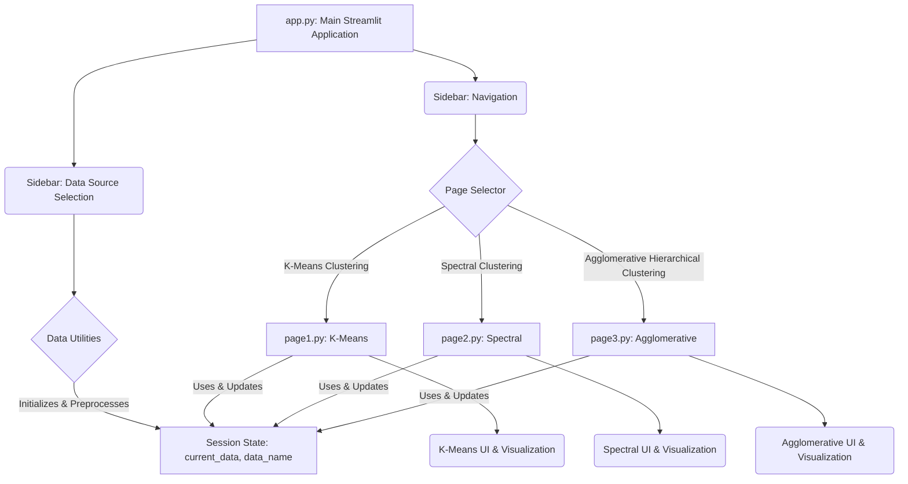

id: 691f56a7680d55964bf2fe6d_documentation
summary: Unsupervised learning Documentation
feedback link: https://docs.google.com/forms/d/e/1FAIpQLSfWkOK-in_bMMoHSZfcIvAeO58PAH9wrDqcxnJABHaxiDqhSA/viewform?usp=sf_link
environments: Web
status: Published
# QuLab: Interactive Unsupervised Clustering with Streamlit

## 1. Introduction to QuLab and Unsupervised Learning
Duration: 0:05

Welcome to the QuLab Codelab! In this lab, we delve into the fascinating world of **Unsupervised Learning**, specifically focusing on clustering techniques. Unsupervised learning is a powerful paradigm in machine learning where algorithms learn patterns from unlabeled data, meaning there are no pre-defined output variables. This is particularly useful in finance for tasks such as identifying distinct market segments, grouping similar assets for portfolio diversification, or detecting anomalous trading behavior.

This Streamlit application provides an interactive platform for exploring and understanding various unsupervised clustering techniques. It allows developers and analysts to:
*   Understand the operational principles of k-Means, Spectral, and Agglomerative Hierarchical clustering algorithms.
*   Analyze the impact of different parameters (e.g., number of clusters $k$, linkage methods, affinity kernels) on clustering results.
*   Visualize cluster assignments in 2D/3D space and interpret dendrograms generated by hierarchical clustering.
*   Gain insights into how clustering can be applied for tasks such as financial market segmentation or portfolio construction, with specific demonstrations using synthetic financial data.

The application is structured into a main `app.py` file handling navigation and data management, and separate `application_pages` modules for each clustering algorithm. This modular design enhances readability, maintainability, and scalability.

<aside class="positive">
<b>Why Unsupervised Learning in Finance?</b>
In financial markets, data often lacks explicit labels. Unsupervised clustering can help in:
<ul>
    <li><b>Market Segmentation:</b> Grouping customers or companies with similar financial behaviors.</li>
    <li><b>Portfolio Diversification:</b> Identifying uncorrelated assets to build robust portfolios.</li>
    <li><b>Anomaly Detection:</b> Flagging unusual trading patterns or fraudulent activities.</li>
    <li><b>Risk Management:</b> Grouping assets based on risk profiles.</li>
</ul>
</aside>

### Application Architecture
The QuLab application follows a modular architecture, making it easy to understand and extend.



This diagram illustrates how `app.py` serves as the central hub, managing data selection and navigation, while delegating the specific clustering logic and UI to individual page modules. All pages share data through Streamlit's `st.session_state`.

## 2. Setting Up Your Development Environment
Duration: 0:10

To get started with QuLab, you'll need to set up a Python development environment and install the necessary libraries.

### Prerequisites
*   Python 3.8+
*   `pip` (Python package installer)

### 1. Create a Virtual Environment (Recommended)
Virtual environments help isolate project dependencies.

```console
python -m venv venv
```

### 2. Activate the Virtual Environment
*   **On Windows:**
    ```console
    .\venv\Scripts\activate
    ```
*   **On macOS/Linux:**
    ```console
    source venv/bin/activate
    ```

### 3. Install Required Libraries
Install all the necessary Python packages using pip.
```console
pip install streamlit numpy pandas plotly-express matplotlib scikit-learn scipy
```

<aside class="positive">
Always use a virtual environment for your Python projects. It prevents conflicts between dependencies of different projects and keeps your global Python installation clean.
</aside>

## 3. Understanding the Core Application (`app.py`)
Duration: 0:15

The `app.py` file is the entry point of our Streamlit application. It handles the initial setup, defines global utility functions, manages data loading and preprocessing, and orchestrates navigation between different clustering pages using Streamlit's sidebar.

Let's examine the key components of `app.py`.

### Initial Setup and Global Imports
The application starts by importing all necessary libraries and configuring the Streamlit page.
```python
import streamlit as st
import numpy as np
import pandas as pd
import plotly.express as px
import matplotlib.pyplot as plt
from scipy.cluster.hierarchy import dendrogram, linkage

# Scikit-learn imports
from sklearn.cluster import KMeans, SpectralClustering, AgglomerativeClustering
from sklearn.preprocessing import StandardScaler
from sklearn.datasets import make_blobs, make_circles
from sklearn.metrics import silhouette_score

# Suppress warnings for cleaner output
import warnings
warnings.filterwarnings('ignore')

st.set_page_config(page_title="QuLab", layout="wide")
st.sidebar.image("https://www.quantuniversity.com/assets/img/logo5.jpg")
st.sidebar.divider()
st.title("QuLab")
st.divider()
```
*   `st.set_page_config`: Configures the browser tab title and the layout of the page (e.g., `wide` for more space).
*   `st.sidebar.image` and `st.sidebar.divider()`: Add branding and visual separation to the sidebar.

### Data Generation and Preprocessing Utilities
`app.py` contains two crucial utility functions: `load_synthetic_financial_data` for generating sample datasets and `preprocess_data` for standardizing the features. These functions are explained in detail in the next step.

```python
#  Utility functions for data generation and preprocessing 
def load_synthetic_financial_data(dataset_type):
    # ... (function body as in app.py) ...
    pass

def preprocess_data(data: (np.ndarray | pd.DataFrame)) -> np.ndarray:
    # ... (function body as in app.py) ...
    pass
```

### Session State Management
Streamlit's `st.session_state` is used to maintain the state of variables across reruns of the application. This is essential for storing our loaded and scaled data, making it accessible to all pages.

```python
# Initialize session state for data
if 'scaled_kmeans_data' not in st.session_state:
    st.session_state.kmeans_data_raw = load_synthetic_financial_data('kmeans_portfolio')
    st.session_state.scaled_kmeans_data = preprocess_data(st.session_state.kmeans_data_raw)

if 'scaled_spectral_data' not in st.session_state:
    st.session_state.spectral_data_raw = load_synthetic_financial_data('spectral_assets')
    st.session_state.scaled_spectral_data = preprocess_data(st.session_state.spectral_data_raw)

if 'user_data_df' not in st.session_state:
    st.session_state.user_data_df = None
    st.session_state.scaled_user_data = None

# Initialize current_data and data_name in session state for cross-page access
if 'current_data' not in st.session_state:
    st.session_state.current_data = None
if 'data_name' not in st.session_state:
    st.session_state.data_name = ""
```
This code initializes default synthetic datasets and variables to hold user-uploaded data, ensuring they are available globally throughout the app's lifetime.

### Data Source Selection and Upload
The sidebar allows users to select between two predefined synthetic datasets (for K-Means and Spectral clustering demos) or to upload their own CSV file.

```python
st.sidebar.header("Data Source Selection")
data_source_option = st.sidebar.radio(
    "Choose Data Source:",
    ("K-Means Portfolio Data (Demo)", "Spectral Assets Data (Demo)", "Upload Your Own Data")
)

if data_source_option == "K-Means Portfolio Data (Demo)":
    st.session_state.current_data = st.session_state.scaled_kmeans_data
    st.session_state.data_name = "K-Means Portfolio Data"
    st.sidebar.info(f"Loaded {st.session_state.data_name} with shape: {st.session_state.current_data.shape}")
# ... (similar logic for Spectral Assets Data) ...
elif data_source_option == "Upload Your Own Data":
    uploaded_file = st.sidebar.file_uploader("Upload CSV file", type=["csv"])
    if uploaded_file is not None:
        try:
            st.session_state.user_data_df = pd.read_csv(uploaded_file)
            st.session_state.scaled_user_data = preprocess_data(st.session_state.user_data_df.values)
            st.session_state.current_data = st.session_state.scaled_user_data
            st.session_state.data_name = "Uploaded User Data"
            st.sidebar.success("CSV file successfully uploaded and preprocessed!")
            st.sidebar.info(f"Loaded {st.session_state.data_name} with shape: {st.session_state.current_data.shape}")
        except Exception as e:
            st.sidebar.error(f"Error processing uploaded file: {e}")
            st.session_state.current_data = None
    else:
        st.session_state.current_data = None
        st.sidebar.warning("Please upload a CSV file for analysis.")
```
When a data source is selected or uploaded, `st.session_state.current_data` and `st.session_state.data_name` are updated, making the selected data available to all sub-pages.

### Page Navigation
The sidebar also contains a `selectbox` for navigating between the different clustering algorithms.

```python
page = st.sidebar.selectbox(label="Navigation", options=["K-Means Clustering", "Spectral Clustering", "Agglomerative Hierarchical Clustering"])
if page == "K-Means Clustering":
    from application_pages.page1 import run_page1
    run_page1()
elif page == "Spectral Clustering":
    from application_pages.page2 import run_page2
    run_page2()
elif page == "Agglomerative Hierarchical Clustering":
    from application_pages.page3 import run_page3
    run_page3()
```
This conditional logic imports and executes the `run_pageX()` function from the corresponding module, effectively rendering the chosen page.

## 4. Data Generation and Preprocessing Utilities
Duration: 0:10

Data preparation is a critical step in any machine learning pipeline. In QuLab, we use two utility functions defined in `app.py` to handle this: `load_synthetic_financial_data` and `preprocess_data`.

### `load_synthetic_financial_data` Function
This function generates synthetic datasets tailored for demonstrating specific clustering characteristics.

```python
def load_synthetic_financial_data(dataset_type):
    """
    Generates and returns a synthetic financial dataset based on the specified type.
    
    Arguments:
        dataset_type (str): A string indicating the type of synthetic dataset to generate
                            (e.g., 'kmeans_portfolio', 'spectral_assets').
    
    Output:
        X (np.ndarray): The generated synthetic dataset.
    """
    if not isinstance(dataset_type, str):
        raise TypeError("dataset_type must be a string.")

    if dataset_type == 'kmeans_portfolio':
        X, _ = make_blobs(n_samples=300, n_features=2, centers=3, cluster_std=0.5, random_state=42)
        return X
    elif dataset_type == 'spectral_assets':
        X, _ = make_circles(n_samples=300, factor=0.5, noise=0.05, random_state=42)
        return X
    elif dataset_type == "":
        raise ValueError("dataset_type cannot be an empty string.")
    else:
        raise ValueError(f"Unsupported dataset_type: '{dataset_type}'.")
```
*   `make_blobs`: Creates Gaussian blobs, suitable for demonstrating k-Means, which works well with convex clusters.
*   `make_circles`: Creates concentric circles, a classic dataset for algorithms like Spectral Clustering that can handle non-globular shapes.
These synthetic datasets mimic characteristics often found in financial market data, such as distinct groups of assets or more complex, intertwined relationships.

### `preprocess_data` Function
This function applies feature scaling, a crucial step for many clustering algorithms.

```python
def preprocess_data(data: (np.ndarray | pd.DataFrame)) -> np.ndarray:
    """
    Applies StandardScaler from sklearn.preprocessing to the input data, ensuring all features are
    scaled to a standard range. This preprocessing step is crucial for distance-based clustering
    algorithms to prevent features with larger ranges from dominating the distance calculations.

    Arguments:
        data (np.ndarray or pd.DataFrame): The input data to be preprocessed.

    Output:
        scaled_data (np.ndarray): The scaled data with standardized features.
    """
    if not isinstance(data, (np.ndarray, pd.DataFrame)):
        raise TypeError("Input data must be a numpy.ndarray or a pandas.DataFrame.")

    scaler = StandardScaler()
    scaled_data = scaler.fit_transform(data)
    
    return scaled_data
```
<aside class="negative">
<b>Importance of Feature Scaling:</b>
Distance-based algorithms (like k-Means and Agglomerative Clustering) are highly sensitive to the scale of features. If one feature has a much larger range of values than another, it can disproportionately influence the distance calculations, leading to biased clustering results. `StandardScaler` transforms data to have a mean of 0 and a standard deviation of 1, making all features contribute equally to the distance computations.
</aside>

## 5. K-Means Clustering: Theory and Implementation (`application_pages/page1.py`)
Duration: 0:20

The `application_pages/page1.py` file implements the K-Means clustering algorithm and its interactive visualization.

### K-Means Clustering Theory
k-Means clustering is a partition-based algorithm that aims to partition $n$ observations into $k$ clusters, where each observation belongs to the cluster with the nearest mean (centroid). The algorithm iteratively assigns data points to clusters and updates cluster centroids until convergence.

The objective function, often called the inertia, that k-Means aims to minimize is the sum of squared distances of samples to their closest cluster center:
$$ J = \sum_{i=0}^{n}\min_{\mu_j \in C}(||x_i - \mu_j||^2) $$
where $J$ is the objective function, $x_i$ is a data point, $\mu_j$ is the centroid of cluster $j$, and $C$ is the set of all centroids. The algorithm typically proceeds as follows:
1.  Initialize $k$ centroids randomly.
2.  For a fixed number of iterations:
    a. Assign each data point to its closest centroid.
    b. Update each centroid to be the mean of all points assigned to that cluster.
    c. If centroids do not change significantly, break.
3.  Output cluster assignments and final centroids.

### K-Means Implementation (`run_kmeans`)
The `run_kmeans` function encapsulates the k-Means algorithm from `sklearn.cluster`.

```python
# application_pages/page1.py
from sklearn.cluster import KMeans
from sklearn.metrics import silhouette_score

def run_kmeans(data, n_clusters, random_state=42):
    """Runs K-Means clustering."""
    kmeans = KMeans(n_clusters=n_clusters, random_state=random_state, n_init='auto')
    kmeans.fit(data)
    return kmeans.labels_, kmeans.cluster_centers_
```
This function takes the preprocessed data and the desired number of clusters ($k$) as input, then returns the cluster labels for each data point and the final coordinates of the cluster centroids.

### Interactive Parameter Tuning and Evaluation
The choice of the number of clusters, $k$, is critical for k-Means. We can evaluate the quality of clustering using metrics like the Silhouette Score. A higher Silhouette Score generally indicates better-defined clusters, where data points are well-matched to their own cluster and poorly matched to neighboring clusters. The Silhouette Coefficient $s(i)$ for a single sample is calculated as:
$$ s(i) = \frac{b(i) - a(i)}{\max(a(i), b(i))} $$
where $a(i)$ is the mean distance between $i$ and all other data points in the same cluster, and $b(i)$ is the mean distance between $i$ and all other data points in the *next nearest* cluster.

We can interactively adjust $k$ and observe its impact on the clusters and the Silhouette Score. This helps in finding an optimal $k$ that balances clustering quality with business interpretability.

The `run_page1` function orchestrates the Streamlit UI for K-Means:
```python
# application_pages/page1.py
def run_page1():
    current_data = st.session_state.get('current_data')
    data_name = st.session_state.get('data_name', "Current Data")

    # ... markdown for theory ...

    if current_data is not None:
        if current_data.shape[1] < 2:
            st.warning("K-Means clustering requires at least 2 features for 2D visualization. Please upload data with more features or select a demo dataset.")
        else:
            n_clusters_kmeans = st.slider('Number of Clusters (k) for K-Means:', min_value=2, max_value=10, value=3, key='kmeans_n_clusters')

            kmeans_labels, kmeans_centers = run_kmeans(current_data, n_clusters=n_clusters_kmeans)

            if n_clusters_kmeans > 1:
                silhouette_avg_kmeans = silhouette_score(current_data, kmeans_labels)
                st.metric(label=f"Silhouette Score for {n_clusters_kmeans} clusters:", value=f"{silhouette_avg_kmeans:.3f}")
            else:
                st.info("Silhouette Score cannot be calculated for less than 2 clusters.")

            kmeans_df_interactive = pd.DataFrame(current_data[:, :2], columns=['Feature 1', 'Feature 2']) # Limit to 2 features for 2D plot
            kmeans_df_interactive['Cluster'] = kmeans_labels.astype(str)

            fig_kmeans = px.scatter(kmeans_df_interactive, x='Feature 1', y='Feature 2', color='Cluster',
                                    title=f'K-Means Clustering with k={n_clusters_kmeans} of {data_name}',
                                    hover_data=['Cluster'])

            centroids_df_interactive = pd.DataFrame(kmeans_centers[:, :2], columns=['Feature 1', 'Feature 2'])
            centroids_df_interactive['Cluster'] = [f'Centroid {i}' for i in range(len(kmeans_centers))]

            fig_kmeans.add_scatter(x=centroids_df_interactive['Feature 1'], y=centroids_df_interactive['Feature 2'],
                                mode='markers', marker=dict(symbol='x', size=15, color='black', line=dict(width=2)),
                                name='Centroids', showlegend=True)

            fig_kmeans.update_layout(legend_title_text='Cluster / Centroid')
            st.plotly_chart(fig_kmeans, use_container_width=True)
            # ... markdown for interpretation ...
    else:
        st.info("Please select a data source from the sidebar to run K-Means clustering.")
```
The scatter plot visually represents the distinct clusters identified by the k-Means algorithm. Each color corresponds to a different cluster, and the black 'x' markers indicate the calculated centroids. In a financial context, these clusters could represent different types of stocks (e.g., growth stocks, value stocks, defensive stocks), aiding in diversified portfolio construction by selecting assets from different segments. By adjusting the slider, you can observe how the cluster boundaries and assignments change. The Silhouette Score provides a quantitative measure of clustering quality, helping to identify a suitable number of clusters for the given dataset.

## 6. Spectral Clustering: Theory and Implementation (`application_pages/page2.py`)
Duration: 0:20

The `application_pages/page2.py` file details Spectral Clustering, a powerful method for identifying non-globular clusters.

### Spectral Clustering Theory
Spectral Clustering is a technique that uses the eigenvalues (spectrum) of a similarity matrix to perform dimensionality reduction before clustering in a lower-dimensional space. It is particularly effective for discovering non-globular or intertwined clusters by leveraging the graph structure of the data. The process generally follows these steps:
1.  **Construct similarity matrix $W$**: Measures the similarity between all pairs of data points. A common choice is the Gaussian (Radial Basis Function) kernel:
    $$ W[i, j] = \exp\left(-\frac{||x_i - x_j||^2}{2\sigma^2}\right) $$
    where $x_i$ and $x_j$ are data points, and $\sigma$ is a scaling parameter that controls the width of the similarity decay.
2.  **Compute degree matrix $D$**: A diagonal matrix where $D[i, i]$ is the sum of similarities of data point $i$ with all other data points:
    $$ D[i, i] = \sum_j W[i, j] $$
3.  **Compute normalized Laplacian $L_{norm}$**: A matrix often used to reveal the graph structure and its connected components:
    $$ L_{norm} = D^{-1/2} \times (D - W) \times D^{-1/2} $$
4.  **Find $k$ smallest eigenvectors of $L_{norm}$**: These eigenvectors correspond to the lowest frequencies in the graph and form a new lower-dimensional, spectrally transformed representation of the data.
5.  **Form matrix $V$**: Consisting of these $k$ eigenvectors as columns.
6.  **Normalize rows of $V$ to unit length**.
7.  **Apply k-Means clustering to the rows of $V$**: This groups the data points in the transformed, lower-dimensional space.
8.  **Output cluster assignments**.

### Spectral Clustering Implementation (`run_spectral_clustering`)
The `run_spectral_clustering` function applies the `SpectralClustering` model from `sklearn.cluster`.

```python
# application_pages/page2.py
from sklearn.cluster import SpectralClustering
from sklearn.metrics import silhouette_score

def run_spectral_clustering(data, n_clusters, affinity_kernel, gamma, random_state=42):
    """
    Executes Spectral Clustering on the given data using sklearn.cluster.SpectralClustering.
    """
    model = SpectralClustering(
        n_clusters=n_clusters,
        affinity=affinity_kernel,
        gamma=gamma,
        random_state=random_state,
        n_init=10
    )
    cluster_labels = model.fit_predict(data)
    return cluster_labels
```
This function enables easy experimentation with different `n_clusters`, `affinity_kernel` (e.g., 'rbf', 'nearest_neighbors'), and `gamma` parameters.

### Interactive Parameter Tuning and Evaluation
Similar to k-Means, the number of clusters $k$ is an important parameter for Spectral Clustering. Additionally, the `affinity` kernel (how similarity is defined) significantly impacts the clustering results. We can explore these parameters interactively, along with the Silhouette Score, to understand their influence on cluster formation and quality.

The `run_page2` function presents the interactive UI for Spectral Clustering:
```python
# application_pages/page2.py
def run_page2():
    current_data = st.session_state.get('current_data')
    data_name = st.session_state.get('data_name', "Current Data")

    # ... markdown for theory ...

    if current_data is not None:
        if current_data.shape[1] < 2:
            st.warning("Spectral clustering requires at least 2 features for 2D visualization. Please upload data with more features or select a demo dataset.")
        else:
            col1, col2 = st.columns(2)
            n_clusters_spectral = col1.slider('Number of Clusters (k) for Spectral Clustering:', min_value=2, max_value=10, value=3, key='spectral_n_clusters')
            affinity_kernel_spectral = col2.selectbox('Affinity Kernel for Spectral Clustering:', options=['rbf', 'nearest_neighbors'], value='rbf', key='spectral_affinity_kernel')
            gamma_val_spectral = 1.0 # Default gamma for rbf, not made interactive for brevity

            try:
                spectral_labels = run_spectral_clustering(current_data, n_clusters_spectral, affinity_kernel_spectral, gamma_val_spectral)

                unique_labels_count_spectral = len(np.unique(spectral_labels))
                if unique_labels_count_spectral > 1 and unique_labels_count_spectral <= len(current_data) -1:
                    silhouette_avg_spectral = silhouette_score(current_data, spectral_labels)
                    st.metric(label=f"Silhouette Score for {n_clusters_spectral} clusters:", value=f"{silhouette_avg_spectral:.3f}")
                else:
                    st.info(f"Silhouette Score cannot be computed for {unique_labels_count_spectral} unique clusters (requires >1 and < n_samples).")

                spectral_df_interactive = pd.DataFrame(current_data[:, :2], columns=['Feature 1', 'Feature 2'])
                spectral_df_interactive['Cluster'] = spectral_labels.astype(str)

                title_score_spectral = f'Silhouette Score: {silhouette_avg_spectral:.3f}' if unique_labels_count_spectral > 1 else 'Silhouette Score: N/A'
                fig_spectral = px.scatter(spectral_df_interactive, x='Feature 1', y='Feature 2', color='Cluster',
                                        title=f'Spectral Clustering (k={n_clusters_spectral}, Kernel="{affinity_kernel_spectral}") of {data_name}<br>{title_score_spectral}',
                                        hover_data=['Cluster'])
                fig_spectral.update_layout(legend_title_text='Cluster')
                st.plotly_chart(fig_spectral, use_container_width=True)
                # ... markdown for interpretation ...
            except Exception as e:
                st.error(f"Spectral Clustering failed with given parameters: {e}")
    else:
        st.info("Please select a data source from the sidebar to run Spectral Clustering.")
```
Observe how changes in `n_clusters` and the `affinity_kernel` affect the resulting clusters and the Silhouette Score. Different affinity kernels might be more appropriate for different underlying data structures. For example, 'rbf' is good for capturing dense regions and non-linear boundaries, while 'nearest_neighbors' focuses on local connectivity. This interactive exploration helps in selecting parameters that yield meaningful and stable clusters for financial assets.

## 7. Agglomerative Hierarchical Clustering: Theory and Implementation (`application_pages/page3.py`)
Duration: 0:25

The `application_pages/page3.py` file covers Agglomerative Hierarchical Clustering, which builds a hierarchy of clusters.

### Agglomerative Hierarchical Clustering Theory
Agglomerative Hierarchical Clustering builds a hierarchy of clusters from individual data points. It is a "bottom-up" approach, where each data point starts as its own cluster, and then pairs of clusters are iteratively merged based on their proximity until all points belong to a single cluster or a desired number of clusters is reached. This process forms a tree-like structure called a dendrogram.

Key concepts include:
*   **Distance Metric**: How the distance between individual data points is measured (e.g., Euclidean, Manhattan, Cosine). This defines the proximity between any two data points.
*   **Linkage Method**: How the distance between two clusters is defined based on the distances between their constituent data points. Common methods include:
    *   **Single Linkage**: The shortest distance between any two points in the two clusters. This method is prone to chaining, where clusters are merged due to single close points.
        $$ d(C_i, C_j) = \min_{x \in C_i, y \in C_j} d(x, y) $$
    *   **Complete Linkage**: The maximum distance between any two points in the two clusters. This tends to produce compact, spherical clusters.
        $$ d(C_i, C_j) = \max_{x \in C_i, y \in C_j} d(x, y) $$
    *   **Average Linkage**: The average distance between all pairs of points across the two clusters. This offers a compromise between single and complete linkage.
        $$ d(C_i, C_j) = \text{mean}_{x \in C_i, y \in C_j} d(x, y) $$
    *   **Ward Linkage**: Minimizes the variance of the clusters being merged. It calculates the increase in the total within-cluster variance after merging, generally favoring compact, spherical clusters of similar size.

Understanding these methods is crucial for financial applications, as the choice impacts how asset groups are formed (e.g., tightly correlated groups vs. loosely related ones).

### Agglomerative Clustering Implementation (`run_hierarchical_clustering`)
The `run_hierarchical_clustering` function utilizes `AgglomerativeClustering` from `sklearn.cluster`.

```python
# application_pages/page3.py
from sklearn.cluster import AgglomerativeClustering
from sklearn.metrics import silhouette_score

def run_hierarchical_clustering(data, n_clusters, linkage_method, affinity_metric):
    """Runs Agglomerative Hierarchical Clustering."""
    agg_clustering = AgglomerativeClustering(
        n_clusters=n_clusters,
        linkage=linkage_method,
        metric=affinity_metric
    )
    cluster_labels = agg_clustering.fit_predict(data)
    return cluster_labels
```
This function allows for flexible selection of `n_clusters`, `linkage_method`, and `affinity_metric`.

### Dendrogram Visualization (`plot_dendrogram`)
A key output of hierarchical clustering is the dendrogram, which visually represents the hierarchy of clusters.

```python
# application_pages/page3.py
import matplotlib.pyplot as plt
from scipy.cluster.hierarchy import dendrogram, linkage

def plot_dendrogram(data, linkage_matrix, n_clusters_display=None, title="Hierarchical Clustering Dendrogram"):
    """
    Generates and displays an interactive dendrogram using Matplotlib.
    """
    # ... (function body as in page3.py) ...
    pass
```
The `linkage` function from `scipy.cluster.hierarchy` is used to compute the linkage matrix, which is then passed to `dendrogram` for plotting. This function also includes logic to draw a horizontal line at the cut-off height corresponding to the selected number of clusters.

### Interactive Parameter Tuning and Evaluation
The power of hierarchical clustering lies in exploring different linkage methods and distance metrics. We can interactively adjust these parameters along with the desired number of clusters ($k$) to understand their impact on the clustering structure and the Silhouette Score. This interactivity allows for a nuanced understanding of how different assumptions about 'similarity' affect the resulting financial market segments.

The `run_page3` function presents the interactive UI for Agglomerative Hierarchical Clustering:
```python
# application_pages/page3.py
def run_page3():
    current_data = st.session_state.get('current_data')
    data_name = st.session_state.get('data_name', "Current Data")

    # ... markdown for theory ...

    if current_data is not None:
        if current_data.shape[1] < 2:
            st.warning("Agglomerative Hierarchical clustering requires at least 2 features for 2D visualization. Please upload data with more features or select a demo dataset.")
        else:
            col1, col2, col3 = st.columns(3)
            n_clusters_agg = col1.slider('Number of Clusters (k) for Hierarchical:', min_value=2, max_value=10, value=3, key='agg_n_clusters')
            linkage_method_agg = col2.selectbox('Linkage Method:', options=['ward', 'complete', 'average', 'single'], value='ward', key='agg_linkage_method')
            affinity_metric_agg = col3.selectbox('Distance Metric:', options=['euclidean', 'l1', 'l2', 'manhattan', 'cosine'], value='euclidean', key='agg_affinity_metric')

            # Specific validation for 'ward' linkage
            if linkage_method_agg == 'ward' and affinity_metric_agg != 'euclidean':
                st.warning("When linkage_method is 'ward', affinity_metric must be 'euclidean'. Changing metric to 'euclidean'.")
                affinity_metric_agg = 'euclidean' # Force correction for ward

            try:
                agg_labels = run_hierarchical_clustering(current_data, n_clusters=n_clusters_agg, linkage_method=linkage_method_agg, affinity_metric=affinity_metric_agg)

                unique_labels_agg = np.unique(agg_labels)
                if len(unique_labels_agg) < 2 or len(unique_labels_agg) > len(current_data) -1:
                    silhouette_avg_agg = -1.0
                    st.info(f"Silhouette Score cannot be computed as {len(unique_labels_agg)} unique clusters were formed (requires >1 and < n_samples).")
                else:
                    silhouette_avg_agg = silhouette_score(current_data, agg_labels)
                    st.metric(label=f"Silhouette Score for {n_clusters_agg} clusters:", value=f"{silhouette_avg_agg:.4f}")

                agg_df_interactive = pd.DataFrame(current_data[:, :2], columns=['Feature 1', 'Feature 2'])
                agg_df_interactive['Cluster'] = agg_labels.astype(str)

                title_score_agg = f'Silhouette Score: {silhouette_avg_agg:.4f}' if silhouette_avg_agg != -1.0 else 'Silhouette Score: N/A'
                fig_agg = px.scatter(agg_df_interactive, x='Feature 1', y='Feature 2', color='Cluster',
                                    title=f'Agglomerative Hierarchical Clustering (k={n_clusters_agg}, Linkage: {linkage_method_agg}, Metric: {affinity_metric_agg}) of {data_name}<br>{title_score_agg}',
                                    hover_data=['Cluster'])
                fig_agg.update_layout(legend_title_text='Cluster')
                st.plotly_chart(fig_agg, use_container_width=True)

                st.markdown("")
                st.markdown("### Dendrogram Visualization")
                Z = linkage(current_data, method=linkage_method_agg, metric=affinity_metric_agg)
                plot_dendrogram(current_data, Z, n_clusters_display=n_clusters_agg, 
                                title=f"Hierarchical Clustering Dendrogram with {linkage_method_agg.title()} Linkage")

                # ... markdown for interpretation ...
            except Exception as e:
                st.error(f"Agglomerative Hierarchical Clustering failed with given parameters: {e}")
    else:
        st.info("Please select a data source from the sidebar to run Agglomerative Hierarchical Clustering.")
```
Experiment with different linkage methods and distance metrics. You will observe how these choices significantly influence how clusters are formed and how sensitive the algorithm is to different data distributions. For instance, 'single' linkage can find elongated clusters, while 'ward' tends to find more compact, spherical clusters. The Silhouette Score helps quantify the effectiveness of these parameter choices. In finance, this allows tailoring the clustering approach to specific asset characteristics or market behaviors.

## 8. Running the Application and Experimentation
Duration: 0:05

Now that you understand the structure and components of QuLab, let's run the application and explore its functionalities.

### 1. Run the Streamlit Application
Ensure your virtual environment is active (if you created one). Navigate to the root directory of your project (where `app.py` is located) in your terminal and run:

```console
streamlit run app.py
```
This command will open the Streamlit application in your default web browser.

### 2. Interact with the Application
*   **Data Source Selection:** In the left sidebar, choose between "K-Means Portfolio Data (Demo)", "Spectral Assets Data (Demo)", or "Upload Your Own Data".
    *   For the demo datasets, observe the generated data.
    *   If uploading your own data, prepare a CSV file with numerical features. The first two features will be used for 2D visualization.
*   **Navigation:** Use the "Navigation" selectbox in the sidebar to switch between "K-Means Clustering", "Spectral Clustering", and "Agglomerative Hierarchical Clustering" pages.
*   **Parameter Tuning:** On each page, adjust the sliders and selectboxes to change parameters like the number of clusters ($k$), linkage methods, or affinity kernels.
*   **Observe Results:**
    *   See how the scatter plots and cluster assignments change in real-time.
    *   Monitor the Silhouette Score, which provides a quantitative measure of clustering quality.
    *   For Agglomerative Hierarchical Clustering, observe the dendrogram and how the "cut-off" line changes with the number of clusters.

### 3. Experimentation Tips
*   Try different values of $k$ to see how the Silhouette Score responds. Can you find an "optimal" $k$ for each demo dataset?
*   On the Spectral Clustering page, switch between 'rbf' and 'nearest_neighbors' affinity kernels, especially with the 'Spectral Assets Data (Demo)' to see its effectiveness on non-globular shapes.
*   On the Agglomerative Hierarchical Clustering page, experiment with 'ward' linkage on the K-Means data, and then 'single' or 'complete' on the Spectral data. Notice how different linkage methods produce different cluster shapes.
*   Upload your own dataset. How do these algorithms perform on your data? Does preprocessing make a noticeable difference?

## 9. Conclusion and Further Enhancements
Duration: 0:05

Congratulations! You have successfully navigated the QuLab application, gaining hands-on experience with three fundamental unsupervised clustering algorithms: K-Means, Spectral, and Agglomerative Hierarchical Clustering. You've learned about their theoretical underpinnings, implemented them using `scikit-learn`, and interactively explored the impact of their key parameters on clustering results and evaluation metrics like the Silhouette Score. You've also seen how these techniques can be applied in a financial context for tasks like market segmentation.

### Key Takeaways
*   Unsupervised learning is crucial for discovering hidden patterns in unlabeled data, especially relevant in finance.
*   **K-Means** is efficient for globular, well-separated clusters.
*   **Spectral Clustering** excels at finding complex, non-globular structures by leveraging graph theory.
*   **Agglomerative Hierarchical Clustering** builds a hierarchy, providing a rich structure (dendrogram) and flexibility in defining clusters via linkage methods.
*   Feature scaling is essential for distance-based algorithms.
*   Metrics like the Silhouette Score help evaluate clustering quality, but the "optimal" number of clusters often depends on domain knowledge and business context.

### Further Enhancements
This application serves as a strong foundation. Here are some ideas for extending its capabilities:
*   **More Clustering Algorithms:** Integrate other popular algorithms like DBSCAN, Gaussian Mixture Models (GMM), or OPTICS.
*   **3D Visualizations:** For datasets with three features, offer interactive 3D scatter plots.
*   **Advanced Evaluation Metrics:** Implement other metrics for determining the optimal number of clusters, such as the Elbow method (for K-Means inertia) or Gap Statistic.
*   **Hyperparameter Optimization:** Explore techniques for automatically finding optimal parameters for each algorithm.
*   **Real-world Financial Datasets:** Integrate APIs to fetch real stock price data or financial ratios to perform clustering on actual market data.
*   **Explainable AI (XAI) for Clusters:** Add features to help interpret what defines each cluster (e.g., mean feature values per cluster).

<aside class="positive">
Feel free to fork the repository, experiment with the code, and implement your own enhancements. This is how you truly master these powerful machine learning concepts!
</aside>
